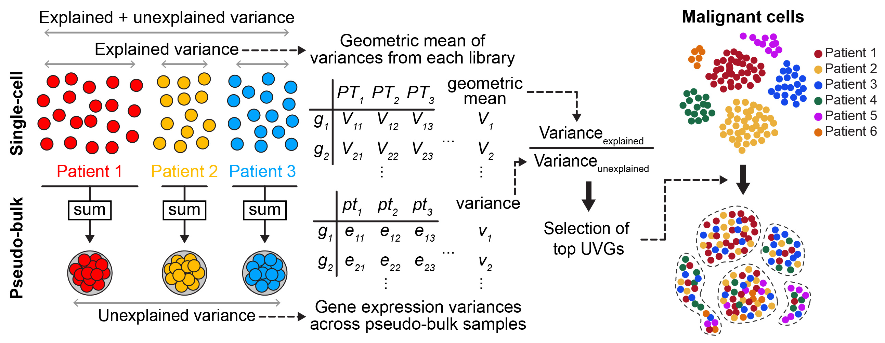

**Clustering Malignant Cell States using Universally Variable Genes** _(manuscript in preparation)_

Sang-Ho Yoon & Jin-Wu Nam

Meta analysis of malignant cells displays unusual patient-specific clustering which prevents these cells from being analyzed in many scRNA-seq studies. We demonstrated that aberrant clusters were originated from sample-specific genomic variations and can be overcome by normalizing gene expression variances to select universally variable genes (UVGs) across patients. Using UVGs, we minimized formation of sample-specific clusters and discovered underlying molecular hallmarks in malignant cells, such as proliferation or inflammatory responses. We also identified that proliferation was a prevalent transcriptional state in primary colon cancer, but dramatically changed to inflammatory/MYC states in chemotherapy resistant or metastatic cancers. UVG analysis can be applied to various scRNA-seq platforms and easily integrated to the existing analytic pipelines for downstream analyses. In summary, clustering of malignant cells using UVGs can define key transcriptional programs shared in malignant cells from different patients.

